```{r setup, include=FALSE}
options(htmltools.dir.version = FALSE)
knitr::opts_chunk$set(
  fig.width=9, fig.height=3.5, fig.retina=3,
  out.width = "100%",
  cache = FALSE,
  echo = TRUE,
  message = FALSE, 
  warning = FALSE,
  hiline = TRUE
)
```

```{r xaringan-themer, include=FALSE, warning=FALSE}
# library(xaringanthemer)
# style_mono_accent(base_color = "#23395b")
```

## Olá! `r emo::ji("wave")`

.pull-left[
Meu nome é **Renata Hirota** e sou jornalista de dados. Sou formada na ECA-USP e graduanda em estatística no IME-USP. Lido com dados desde 2017, trabalho na Associação Brasileira de Jurimetria e no Núcleo Jornalismo. Faço parte da comunidade R-Ladies São Paulo, que promove a diversidade de gênero na comunidade da linguagem de programação R.

`r anicon::faa("github", animate="vertical")`Github: [rmhirota](https://github.com/rmhirota)<br>
`r anicon::faa("twitter", animate="float")`Twitter: [@renata_mh](https://twitter.com/renata_mh)
]

.pull-right[
```{r out.width = "220", fig.align = "center", echo = FALSE}

```
]

---
## Conteúdo

- [Por que é importante?](#pq)

- [Média e outras medidas resumo](#media)

- [Porcentagem e taxas](#pct)

- [Tipos de dados e gráficos](#tipos)

- [Inferência: população e amostra](#inferencia)

- [Armadilhas com dados](#armadilhas)

- [Boas práticas gerais](#praticas)

---
background-image: url(imgs/calvin.png)
background-size: contain
name: pq
## Por que é importante?
---
## Por que é importante?

.pull-left[
- É fácil chegar a conclusões falsas a partir de dados reais

- Pode mudar completamente seu lide

- Fica mais fácil escrever de forma mais clara

- Consequentemente, ajuda a explicar temas complexos ao leitor
]

.pull-right[
```{r out.width = "220", fig.align = "center", echo = FALSE}

```
]

---
class: middle center 
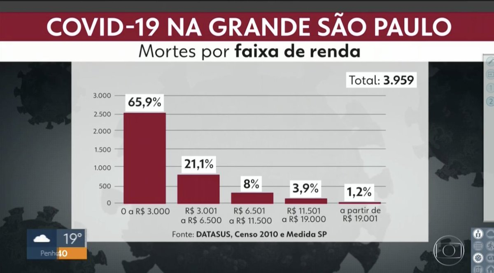


???

A pandemia é o maior exemplo de como entender os dados e o básico de estatística eleva a qualidade da cobertura. De repente, aprendemos sobre taxa de transmissão, média móvel e outros conceitos que não necesariamente faziam parte do nosso dia-a-dia

---
class: middle center
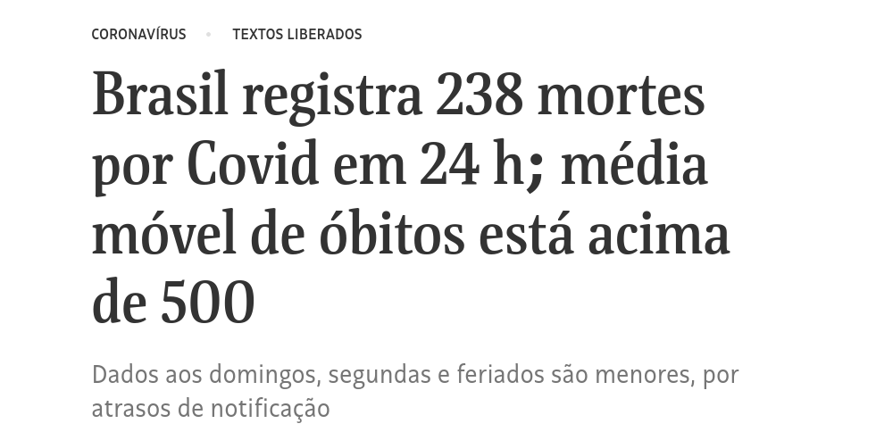

---
class: inverse middle center
name: media
# Média e outras medida resumo
---


## O que significa média?

_altura média_  
_salário médio_  
...

Às vezes, usamos a palavra **média**, mas os conceitos mais adequados à situação são **mediana** ou **moda**.

--

## Média, mediana e moda: medidas de escala

**Média**: Soma de todos os valores dividida pela quantidade. É mais sensível a valores extremos.

**Mediana**: Divide os dados na metade. Metade dos valores é menor que a mediana (e metade é maior).

**Moda**: Valor mais comum. Um conjunto de dados pode ter mais de uma moda.

---
background-image: url(imgs/mean.jpg)
background-size: contain
---
background-image: url(imgs/mean2.jpg)
background-size: contain
---
background-image: url(imgs/median.png)
background-size: contain
---
background-image: url(imgs/median2.png)
background-size: contain
---
background-image: url(imgs/mode.png)
background-size: contain
---
background-image: url(imgs/mode2.png)
background-size: contain
---
## Amplitude, variância e desvio padrão: medidas de dispersão

.pull-left[
**Amplitude**: Diferença entre o valor máximo e valor mínimo.

**Variância**: Média das diferenças ao quadrado entre a média e cada valor.

**Desvio padrão**: Raiz quadrada da variância.
]

.pull-right[
<center>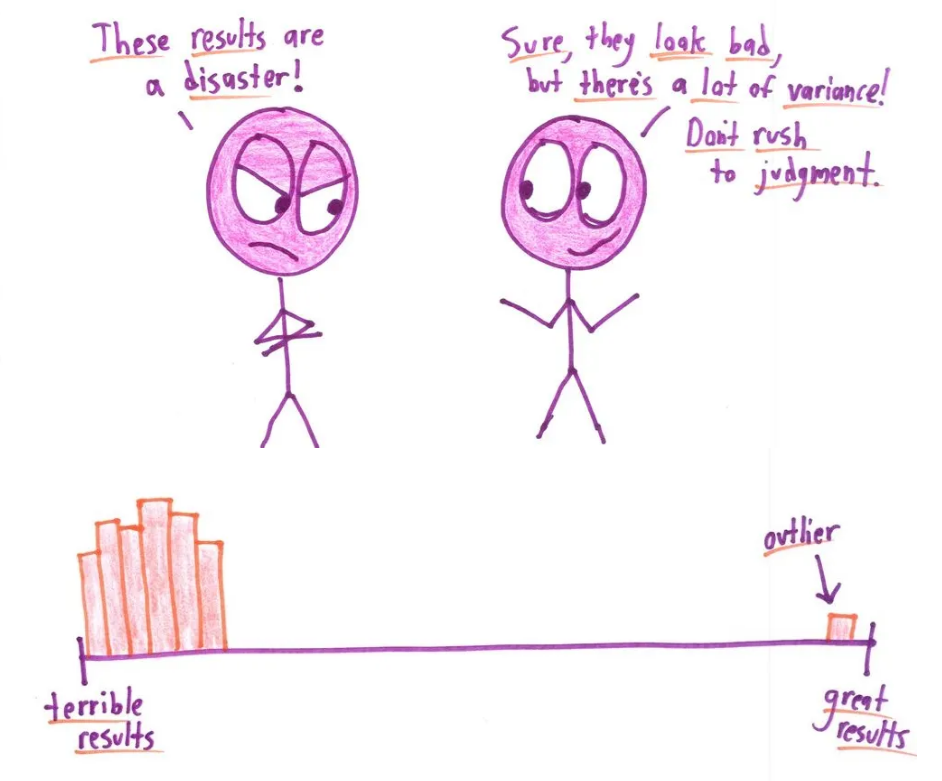</center>
]

---
class: inverse middle center
name: pct
# Porcentagens e taxas
---

## Porcentagens e taxas

.pull-left[
- Comparação de quantidades
- Crescimento ao longo do tempo
- Porcentagem $\neq$ pontos percentuais

<br><br>
<center>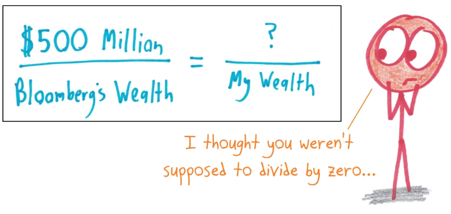</center>
]
--
.pull-right[
A diferença entre porcentagem e ponto percentual é confusa quando a quantidade que estamos medindo em si é uma porcentagem.

Por exemplo: **_Intenção de voto cai de 52% para 36%_**

- A diferença é de 16 pontos percentuais $$(52 - 36 = 16)$$

- Mas a redução em si é de 30,8%, pois $$\frac{36 - 52}{52} = -0,308$$
]

---
class: inverse middle center
name: tipos
# Tipos de Dados

???
Falar sem entrar muito em detalhes sobre os tipos de dados, ou tipos de variáveis, porque é importante pensar nisso e ter isso em conta na hora de criar visualizações, por exemplo.
---
## Variáveis categóricas

<center>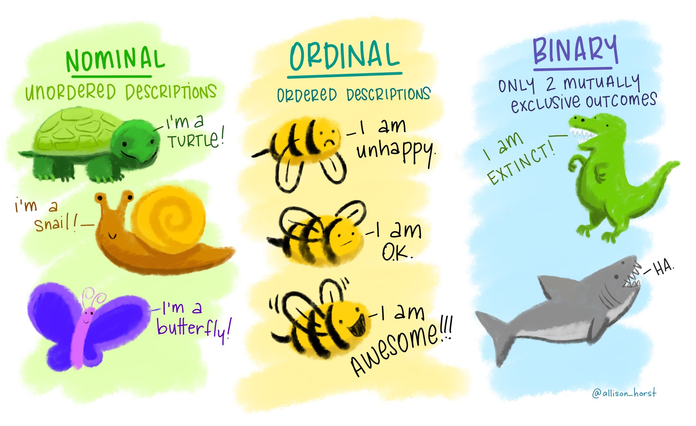</center>

---

## Variáveis numéricas

<center>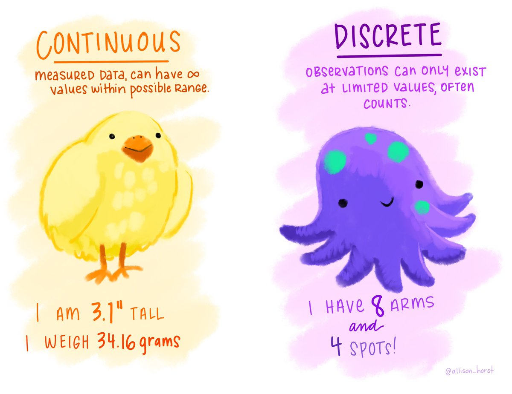</center>

---

## Tipos de dados e tipos de visualizações

.pull-left[
Apesar de depender do contexto, alguns tipos de visualizações são mais comuns para certos tipos de dados.

Gráficos de linha, por exemplo, geralmente denotam uma mudança de valores ao longo do tempo, enquanto contagens por categoria costumam ser ilustradas em gráficos de barras, de pizza, etc.

Para variáveis contínuas, é comum fazer histogramas, que mostram a distribuição dos valores.

#### Referências úteis para visualização de dados:
- [From Data to Viz](https://www.data-to-viz.com)
- [Data Viz Project](https://datavizproject.com)
- [The Data Visualisation Catalogue](https://datavizcatalogue.com)
]

.pull-right[
<center>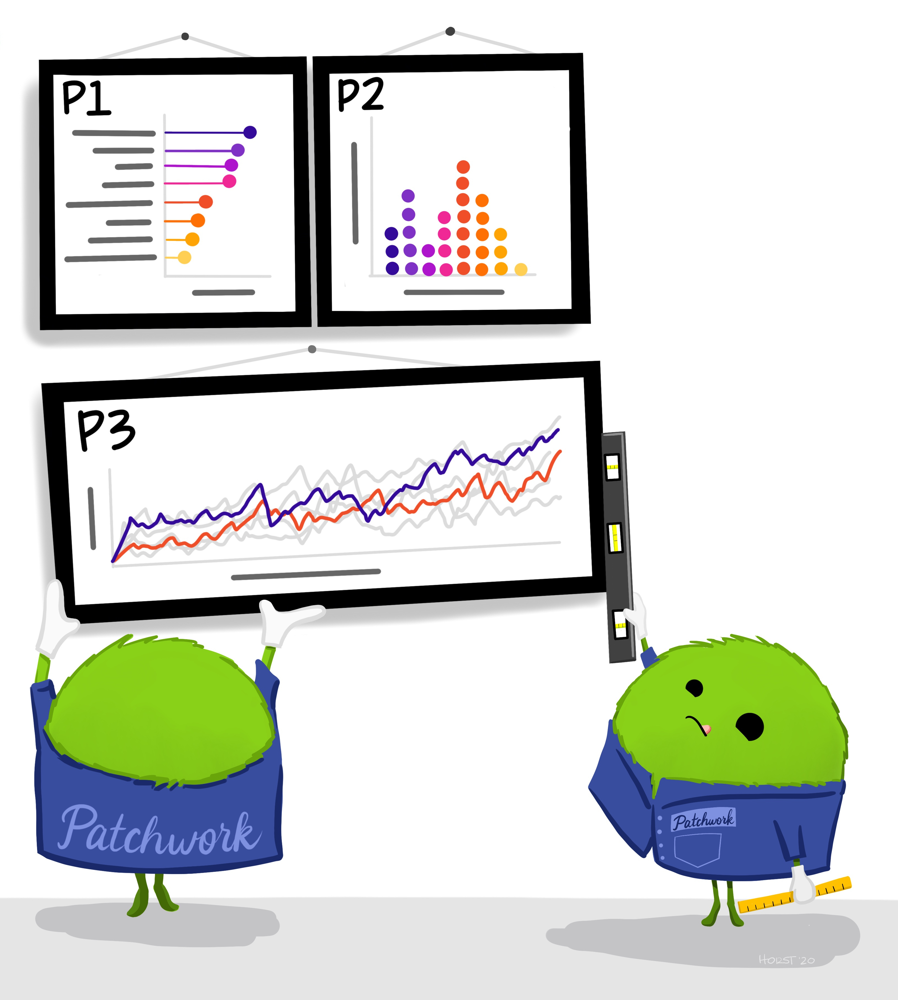</center>
]
---
class: inverse middle center
name: inferencia
# Inferência: população e amostra

---
## Inferência
.pull-left[
**População**: Conjunto de itens ou eventos de interesse

**Amostra**: Subconjunto de uma população

<br>
Fazer inferência significa tirar conclusões a partir de amostras e extrapolá-las à população - o que necessariamente envolve uma medida de incerteza.
]

.pull-right[]


---
class: inverse middle center
name: armadilhas
# Armadilhas com dados
---
## Causalidade e correlação

<center></center>

- É fácil chegar a conclusões não necessariamente verdadeiras
- Se duas coisas estão relacionadas, uma influencia a outra? Causa e efeito?

---
class: middle center
<br></center>
---
class: middle center
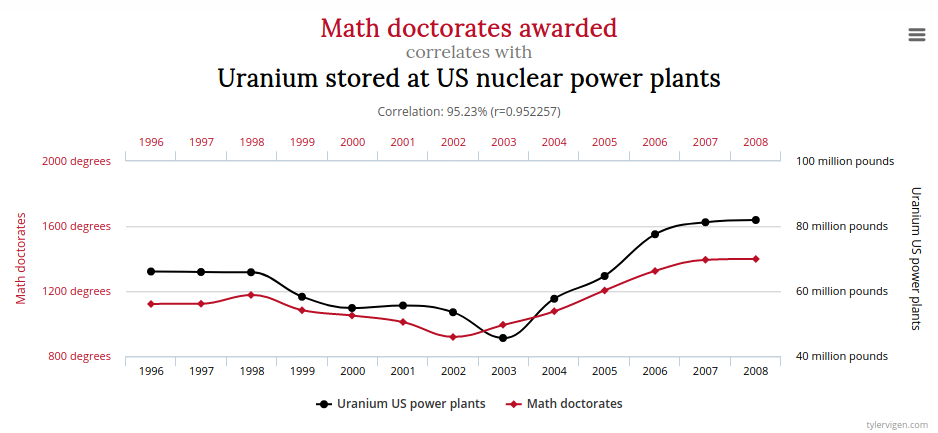<br>

---
class: middle center
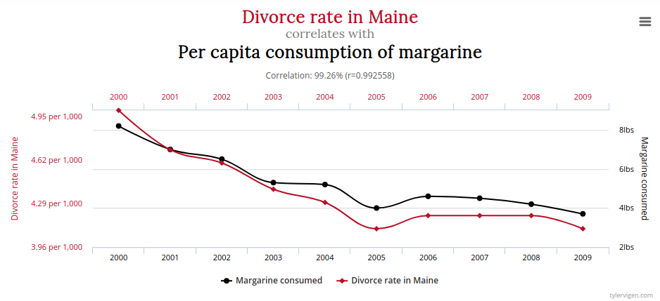<br>
Mais aqui: [Spurrious Correltions](http://tylervigen.com/spurious-correlations)

---
## Cuidado com títulos

Nem sempre é tão óbvio. Na vida real, costuma ser mais sutil.

<center>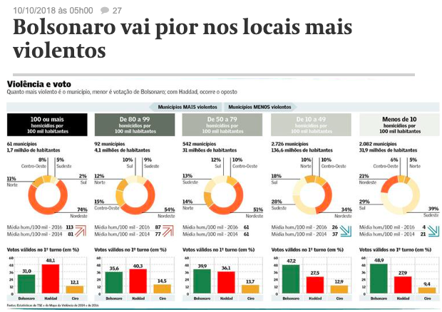</center>

???

No próprio texto, no meio da matéria, dizia que o fator mais importante era regional

_Ao ser apresentado a esses cruzamentos, o cientista político Guilherme Russo, da Fundação Getulio Vargas, resolveu aprofundar a análise com comparações apenas entre municípios de uma mesma região. Nesse exercício, Russo constatou que, considerando só o conjunto dos municípios do Norte e do Nordeste, Bolsonaro apresentou uma tendência de ir progressivamente melhor nas áreas mais violentas. "Sugere que, numa análise geral, mais macro, a questão regional foi mais importante na determinação do voto do que a da violência", afirmou._

---
## Falácia ecológica: conclusões sobre indivíduos a partir de grupos

<center><iframe width="760" height="415" src="https://www.youtube.com/embed/RmYIpnzbQtM" frameborder="0" allow="accelerometer; autoplay; encrypted-media; gyroscope; picture-in-picture" allowfullscreen></iframe></center>

---
class: inverse middle center
name: praticas
# Boas práticas gerais
---
## **Olhe** os dados

<center>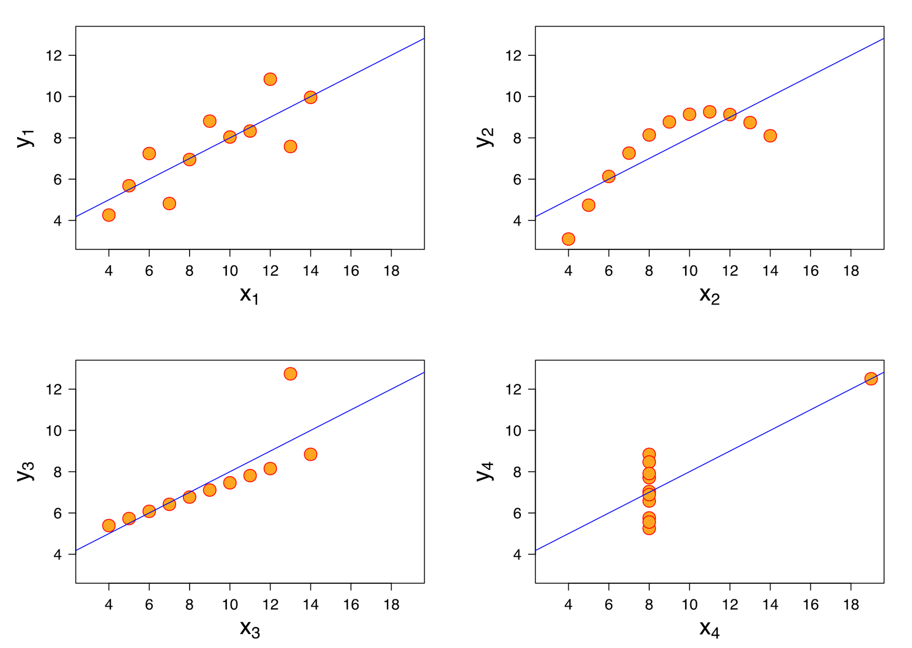<br>
Quarteto de Anscombe
</center>

---
## **Olhe** os dados

<center><blockquote class="twitter-tweet"><p lang="en" dir="ltr">Always visualize your data! (Thanks to <a href="https://twitter.com/AlbertoCairo?ref_src=twsrc%5Etfw">@albertocairo</a> for the artwork 😀) <a href="https://t.co/8D8sgLLqB5">pic.twitter.com/8D8sgLLqB5</a></p>&mdash; Justin Matejka (@JustinMatejka) <a href="https://twitter.com/JustinMatejka/status/770682771656368128?ref_src=twsrc%5Etfw">August 30, 2016</a></blockquote> <script async src="https://platform.twitter.com/widgets.js" charset="utf-8"></script></center>

---
## Pense na **distribuição**

.pull-left[
[O seu salário diante da realidade brasileira](https://www.nexojornal.com.br/interativo/2016/01/11/O-seu-sal%C3%A1rio-diante-da-realidade-brasileira)


]

.pull-right[
- Dá ideia da distribuição de salários

- Compara valores individuais, e não valores resumidos (média)
]

---

## Evite confusão com os números

.pull-left[
[Em cinco dias, PM mata na Grande SP mais do que a média diária no estado](https://noticias.uol.com.br/cotidiano/ultimas-noticias/2019/04/03/em-cinco-dias-pm-mata-na-grande-sp-mais-do-que-a-media-diaria-no-estado.htm)

]
.pull-right[
As comparações são equivalentes?
- No título, dá a impressão de estar comparando a soma de mortes de 5 dias (16) com a média diária (2 por dia)

- Comparação da média de 5 dias com a média de um trimestre

- Populações diferentes (Grande SP vs. estado de SP)]
  
---
## Evite confusão com os números

 Gráficos ajudam!

```{r fig.height=4, fig.width=10, fig.align="center", echo=F}
library(magrittr)
da <- tibble::tibble(
  data = as.Date(c("2018-01-01", "2018-02-01", "2018-03-01", "2019-01-01", "2019-02-01", "2019-03-01")),
  mortes = c(61, 59, 52, 67, 52, 76)
) %>% 
  dplyr::mutate(
    ano = lubridate::year(data),
    mes = lubridate::month(data)
  )

da %>% 
  dplyr::mutate(ano = as.factor(ano), mes = as.factor(mes)) %>% 
  ggplot2::ggplot(ggplot2::aes(x = mes, y = mortes, fill = ano, group = ano)) +
  ggplot2::geom_col(position = "dodge") +
  ggplot2::geom_label(
    ggplot2::aes(label = mortes), 
    fill = "white",
    position = ggplot2::position_dodge(width = 1)
  ) +
  ggplot2::labs(title = "Mortos pela PM em SP", x = "") +
  ggplot2::theme_minimal(18) +
  ggplot2::scale_x_discrete(labels=c("1" = "janeiro", "2" = "fevereiro", "3" = "março")) +
  ggplot2::scale_fill_viridis_d(begin = 0.1, end = 0.6)

```

---
## Resumindo

- Se for resumir seus dados, veja o que faz mais sentido: média? mediana?

- Verifique qual o _tipo_ dos seus dados e que gráficos são mais adequados

- Pense no contexto dos dados: são uma amostra? Qual a incerteza associada?

- Os dados permitem fazer extrapolações?

- Análise exploratória

---
.pull-left[
## Referências
- [Khan Academy - Estatística e Probabilidade](https://pt.khanacademy.org/math/statistics-probability)
- [Curso STAT 414, da Penn State](https://onlinecourses.science.psu.edu/stat414/)
- [The Curious Journalist's Guide to Data, Jonathan Stray](https://towcenter.gitbooks.io/curious-journalist-s-guide-to-data/)
- [Statistics every writer should know](https://www.robertniles.com/stats/)
- [Storytelling with data](http://www.storytellingwithdata.com)

## Ilustrações
- [Allison Horst | RStudio](https://github.com/allisonhorst/stats-illustrations)
- [Ben Orlin | Math with bad drawings](https://mathwithbaddrawings.com/)
]
.pull-right[<br><br><br><br>

]

---
class: inverse, middle, center

# Obrigada!

**Renata Hirota**

`r anicon::faa("github", animate="vertical")`Github: [rmhirota](https://github.com/rmhirota)<br><br>
`r anicon::faa("twitter", animate="float")`Twitter: [@renata_mh](https://twitter.com/renata_mh)<br><br>

